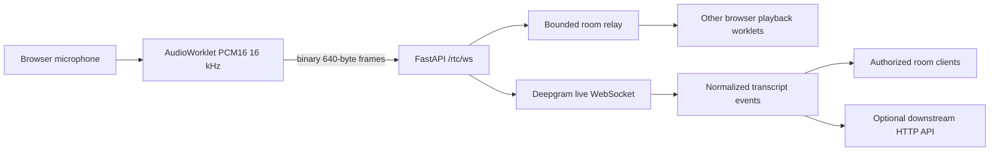

# Centralized audio-room architecture



The calling path is audio-only. FastAPI receives intelligible microphone PCM,
relays each participant's separate stream, and sends it to one Deepgram stream
for that participant. There is no peer connection, SDP, ICE, STUN/TURN, raw
audio persistence, or browser-to-browser media path.

Room state is in memory and must run with one Uvicorn worker. `POST
/rtc/sessions` creates a non-guessable session and meeting code. A client then
opens `/rtc/ws` and sends `room.join` with both values. The server assigns the
participant identity and never trusts an identity in an audio frame.

## Audio framing

The capture worklet resamples microphone input to mono signed little-endian
PCM16 at 16,000 Hz. Normal frames contain exactly 320 samples / 640 bytes
(approximately 20 ms). A binary frame is accepted only after a joined client
has sent `audio.start`; it is relayed to every other participant and to that
participant's ASR session. A JSON `audio.frame` metadata message is queued
immediately before each binary payload, preserving source, sequence, timestamp,
format, and sample count. Per-peer bounded outbound queues prevent a slow
recipient from growing server memory without limit.

The relay computes a small in-process RMS level from each PCM frame and emits
`participant.speaking` only when the speaking state changes. This is an
activity indicator, not provider diarization; participant identity still comes
from the authenticated room connection.

## WebSocket controls and events

Client controls are `room.join`, `room.leave`, `audio.start`, `audio.stop`,
`audio.mute`, `audio.unmute`, and `ping`. Server events are `connected`,
`room.joined`, `participant.joined`, `participant.left`,
`participant.disconnected`, `audio.frame`, `audio.muted`, `audio.unmuted`,
`participant.speaking`, `transcript.partial`, `transcript.final`, `transcription.status`, `room.ended`,
`pong`, and `error`.

Transcript events contain `event_id`, `meeting_id`, `participant_id`,
`session_id`, a session-scoped monotonic `sequence_number`, `event_type`, text,
optional source-relative seconds, timezone-aware `created_at`, and
`protocol_version: "1"`. Partials are replaceable UI state; final events are
deduplicated before optional downstream delivery.

## Configuration

Use Poetry to install the server dependencies. The optional provider settings
are read by `Pot.config.Settings`:

```bash
poetry install --with server,test
export DEEPGRAM_API_KEY=...
export ASR_MODEL=nova-3
export ASR_LANGUAGE=en-US
export ASR_SAMPLE_RATE=16000
export ASR_ENCODING=linear16
export MAX_PARTICIPANTS_PER_ROOM=4
export DOWNSTREAM_API_URL=https://example.invalid/transcripts   # optional
export DOWNSTREAM_API_KEY=...                                  # optional
export DOWNSTREAM_API_TIMEOUT_SECONDS=5
export FORWARD_INTERIM_TRANSCRIPTS=false
poetry run python -m Pot.main
```

If `DEEPGRAM_API_KEY` is absent, rooms and audio relay still work and the UI
shows transcription as unavailable. Final transcript events are sent to the
downstream API only when `DOWNSTREAM_API_URL` is configured; the bounded retry
queue never blocks audio relay.

Deploy behind HTTPS/WSS with a WebSocket-capable proxy. Do not run multiple
workers unless the room registry is replaced with a shared state/fan-out
implementation.
